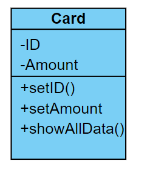
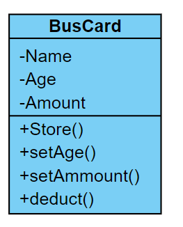

## 練習一

### Description
請建立一個百貨公司會員卡類別（其中所需定義的資料項包括會員號碼與點數，如有多餘考量，可自行定義）。

請定義無引數建構方法，設定會員碼號為 0 與點數為 100，並分別定義設定會員號碼與點數的方法，還要有一個顯示會員資料的方法。

現在百貨公司周年慶活動，滿千送百點數，金額未達千元，則無法送百。

在主程式使用百貨公司會員卡類別建立兩個物件，並輸入其中一個會員號碼（123456）與消費金額（5438），另一個為會員號碼（543838）與消費金額為（60100）。

使用上述方法設定卡片中會員號碼與點數，並於最後顯示兩卡片資訊。



> 請務必建立會員卡的 class 並且利用它完成題目。

### Input
請撰寫一個 while 程式
- 輸入1：表示新增會員，下一行新增該會員的會員號碼及消費金額。
- 輸入2：表示要顯示所有會員資料。

EX:
```
1
123456 5438
1
543838 60100
2
```

### Output
顯示所有會員資料時請顯示以下格式：

| 會員號碼 | 消費金額 | 點數 |
|:--------:|:--------:|:----:|
|  123456  |   5438   | 500  |
|  543838  |  60100   | 6000 |

### Input Samples
```
1
123456 5438
1
543838 60100
2
```

### Output Samples
```
123456 5438 500
543838 60100 6000
```

### Code
```java
import java.util.Scanner;

public class Main {
    public static void main(String[] args) {
        Scanner s = new Scanner(System.in);
        Card[] mem = new Card[100];
        int func = 0, index = 0;

        while(func != 2) {
            func = s.nextInt();
            switch(func) {
                case 1:
                    mem[index] = new Card();
                    mem[index].setMember(s.next(), s.nextInt());
                    break;

                case 2:
                    for(int i = 0 ; i < index ; i++) {
                        mem[i].getData();
                    }
                    break;
            }
            index++;
        }
    }
}

class Card {
    public String ID;
    public int Amount;
    public int Point;

    public Card() {
        this.ID = "0";
        this.Point = 100;
    }

    public void setMember(String id, int money) {
        this.ID = id;
        this.Amount = money;
        this.Point = (money / 1000) * 100;
    }

    public void getData() {
        System.out.println(this.ID + " " + this.Amount + " " + this.Point);
    }
}
```

## 練習二

### Description

台中市公車，里程 10 公里以下免費，超過 10 公里後，每公里的車費為 5 元，其中如果超過 65 歲以上，則車費打一折，如果 18 歲以下，則打五折。

- 請建立一個公車票卡費用類別用以計計算費用（其中所需定義的資料項包括年齡、儲值總和等，如有多餘考量，可自行定義）。

- 請再定義建構方法、設定年齡方法、儲值方法、扣款方法、顯示儲值持卡人年齡與金額的方法。
    
    

- 請在主方法中，寫一個選單（不要顯示，不然測資不會過XD）。

    - 選 1，建立新卡片（輸入年齡與諸值）。
    - 選 2，建立空卡（年齡與儲值總和初始設定為0）。
    - 選 3，設定年齡（輸入年齡）；選3，設定儲值（輸入儲值）。
    - 選 4，進行扣款(乘車距離）。
    - 選 5，顯示卡片資訊。
    - 選 -1，終止選單。

> 請務必建立公車卡的 class 並且利用它完成題目。

### Input
- 輸入 1：建立新卡片（輸入年齡與諸值）

    | 持卡人 | 年紀 | 卡片金額 |
    |:--------:|:--------:|:----:|
    |  Eric  |   20   | 500  |
    > 示意

- 輸入 2：建立空卡（年齡與儲值總和初始設定為 0）

    | 持卡人 |
    |:--------:|
    |  Amy  | 
    > 示意

- 輸入 3：
    1. 輸入 1：設定年齡（輸入年齡）。
    2. 輸入 2：設定儲值（輸入儲值）。

    輸入　3 之後我們會有兩個選擇，一個是修改年齡 ，一個是儲值，把錢加到卡片裡面。

    | 選擇持卡人 | 選擇輸入項目 | 年齡 / 儲值金額 |
    |:--------:|:--------:|:----:|
    |  Eric  |   1   | 25  |
    |  Eric  |   2   | 50  |
    > 示意
    >> 1. 將 Eric 的年齡改為 25。
    >> 2. 將 Eric 的卡片金額增加 50。

-  輸入 4：進行扣款（乘車距離）

    | 選擇持卡人 | 乘車距離 |
    |:--------:|:--------:|
    |  Eric  |   15   |
    > 示意
    >> Eric 搭了 15 公里 前 10 公里免費，多出來的 5 公里，以每公里 5 元計算，所以這趟車資為 25 元要記得從卡片裡扣除。

- 輸入 5：顯示卡片資訊

    | 選擇持卡人 |
    |:--------:|
    |  Eric  |
    > 示意
    >> 輸出 Eric 的卡片資訊。


### Output
只有輸入 5 的選項要輸出資料，請輸出下內容：

| 持卡人 | 年紀 | 卡片金額 |
|:--------:|:--------:|:----:|
|  Eric  |   20   | 500  |
> 示意

### Input Samples
```
1
Eric 20 500
5
Eric
2
Amy
3
Eric 1 25
3
Eric 2 50
5
Eric
4
Eric 15
5
Eric
-1
```

### Output Samples
```
Eric 20 500
Eric 25 550
Eric 25 525
```

### Code
```java
import java.util.Scanner;

public class Main {

	public static void main(String[] args) {
		Scanner s = new Scanner(System.in);
		Card[] mem = new Card[20];
        int function = 0, func3 = 0, id = 0;
        int age, amount, distance;
        String name;
		
        while(function != -1) {
			function = s.nextInt();

            switch(function) {
				case 1:
                    name = s.next();
                    age = s.nextInt();
                    amount = s.nextInt(); 
                    mem[id] = new Card(name, age, amount);
					id++;
                    break;
					
				case 2:
                    name = s.next();
                    mem[id] = new Card();
                    mem[id].Store(name);
                    id++;
					break;
                
                case 3:
                    name = s.next();
                    func3 = s.nextInt();
                    for (int i = 0; i < id; i++) {
                        if (name.equals(mem[i].Name) && func3 == 1) {
                            age = s.nextInt();
                            mem[i].setAge(age);
                        }
                        else if (name.equals(mem[i].Name) && func3 == 2) {
                            amount = s.nextInt();
                            mem[i].setAmount(amount);
                        }
                    }
                    break;

                case 4:
                    name = s.next();
                    distance = s.nextInt();
                    for (int i = 0; i < id; i++) {
                        if (name.equals(mem[i].Name)) {
                            mem[i].deduct(distance);
                        }
                    }
                    break;

                case 5:
                    name = s.next();
                    for (int i = 0; i < id; i++) {
                        if (name.equals(mem[i].Name)) {
                            mem[i].getData();
                        }
                    }
                    break;
			} 
		}
	}
}

class Card {
	public int Age;
	public int Amount;
    public String Name;

    public Card() {
		this.Name = "Empty";
        this.Age = 0;
        this.Amount = 0;
	}

	public Card(String name, int age, int amount) {
		this.Name = name;
        this.Age = age;
        this.Amount = amount;
	}

	public void Store(String name) {
		this.Name = name;
	}

    public void setAge(int age) {
        this.Age = age;
    }
    
    public void setAmount(int amount) {
        this.Amount += amount;
    }
    
    public void deduct(int distance) {
        if (distance > 10) {
            if (this.Age < 18) {
                this.Amount -= (distance - 10) * 5 * 0.5;
            }
            else if (this.Age > 65) {
                this.Amount -= (distance - 10) * 5 * 0.1;
            }
            else {
                this.Amount -= (distance - 10) * 5;
            }           
        } 
    }
	
    public void getData() {
        System.out.printf("%s %d %d\n", this.Name, this.Age, this.Amount);
	}
}
```