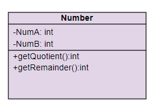
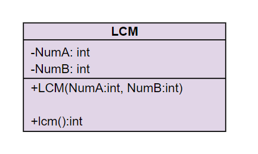
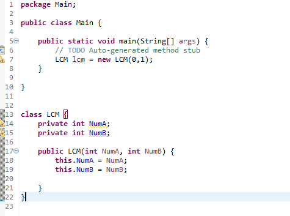

## 練習一

### Description
請定義一個將數字分開的類別，其中定義下列兩種方法。

a)計算整數 a 除以整數 b，所得之商的整數部分。

b)計算整數 a 除以整數 b，所得之餘數的整數部分。

c)利用 a) 和 b) 的方法，撰寫一個方式來輸入一個介於 1 到 32767 之間的整數，然後把它以一連串的數字印出來，而每兩個數字之間以兩個空格作為分隔。

- 例如整數 4562 應印成


- 類別範例：



### Input
無

### Output
無

### Input Samples
```
4562
```

### Output Samples
```
4  5  6  2
```

### Code
```java
import java.util.Scanner;

public class Main {
    public static void main(String[] args) {
        Scanner s = new Scanner(System.in);
        Number num = new Number();
        
        int n = s.nextInt();
        int digitCount = Integer.toString(n).length();
        int digit = (int) Math.pow(10, digitCount - 1);
        int quotient;

        while(digit != 0) {
            quotient = num.getQuotient(n, digit);
            System.out.printf("%d  ", quotient);
        
            n = num.getRemainder(n, digit);
            digit /= 10;
        }
    }
}

class Number {
    private int NumA;
    private int NumB;

    public int getQuotient(int NumA, int NumB) {
        return NumA / NumB;
    }

    public int getRemainder(int NumA, int NumB) {
        return NumA % NumB;
    }
}
```

## 練習二

### Description
請定義一個完全數類別，其中某個整數被稱為完全數（perfect number），是因為這個整數的因數（包括1，但不包括這個數本身）加起來的和等於該數。

例如 6 便是個完全數，因為 6 = 1 + 2 + 3。請撰寫一個方法 `isPerfect()` 來判斷參數 number 是否為一個完全數。

請在 Main Class 中讀取輸入的數字，並且建立一個完全數物件，如需要設定建構子可以自行設定，然後執行 isPerfect Method，輸出結果。


### Input
無

### Output
無

### Input Samples 1
```
6
```

### Output Samples 1
```
isPerfect
```

### Input Samples 2
```
99
```

### Output Samples 2
```
notPerfect
```

### Code
```java
import java.util.Scanner;

public class Main {
    public static void main(String[] args) {
        Scanner s = new Scanner(System.in);
        long Num = s.nextLong();
        long Sum = 1;

        PerfectNumber PN = new PerfectNumber();
        PN.setNum(Num);

        for(int i = 2 ; i < Math.sqrt(Num) ; i++) {
            if(Num % i == 0) {
                Sum += i + Num / i;
            }
        }
        if(PN.isPerfect(Sum)) {
            System.out.println("isPerfect");
        }
        else {
            System.out.println("notPerfect");
        }
    }
}

class PerfectNumber  {
    private long Num;

    public boolean isPerfect(long Sum) {
        if(Sum == Num) {
            return true;
        }
        else {
            return false;
        }
    }

    public void setNum(long num) {
        this.Num = num;
    }
}
```

## 練習三

### Description
請定義一個最小公倍數的類別，輸入兩個整數，其中最小公倍數（lowest common multiple, LCM）是指能夠同時被這兩個數整除的最小整數值。

請撰寫一個方法 lcm，傳回兩個整數的最小公倍數。



請參考下列格式提交：



### Input
無

### Output
無

### Input Samples
```
3 5
```

### Output Samples
```
15
```

### Code
```java
import java.util.Scanner;

public class Main {
    public static void main(String[] args) {
        Scanner s = new Scanner(System.in);
        int NumA = s.nextInt();
        int NumB = s.nextInt();

        LCM lcm = new LCM(NumA, NumB);
        System.out.println(lcm.lcm());
    }
}

class LCM {
    private int NumA;
    private int NumB;

    public LCM(int NumA, int NumB) {
        this.NumA = NumA;
        this.NumB = NumB;
    }

    public int lcm() {
        int i;
        for(i = NumA ; i > 0 ; i++) {
            if( i % NumA == 0 && i % NumB == 0) {
                break;   
            }	
        }
        return i;
    }
}
```