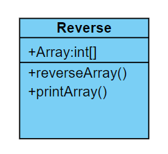
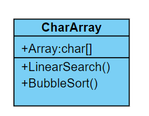
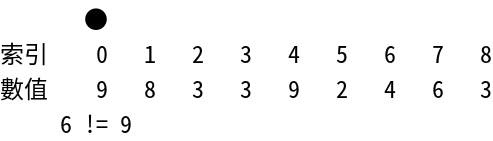
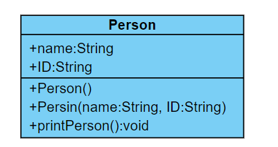

## 練習一

### Description
請建一個 Reverse 類別，其中有一個方法可以把陣列元素反轉，即索引值為 0 的元素成為最後1個索引值，最後 1 個索引元素成為索引值為 0 的元素。

並再定義一個 printArray 方法輸出最後結果。



沒使用 Reverse 類別完成題目者會斟酌扣分。

### Input
Scanner s = new Scanner(System.in);

s.hasNext() // 會回傳有沒有數字

可以使用 `hasNext()` 判斷輸入是否結束

### Output
無

### Input Samples
```
1 2 3 4 9 6 7 8 9
```

### Output Samples
```
9 8 7 6 9 4 3 2 1
```

### Code
```java
import java.util.Scanner;

public class Main {

	public static void main(String[] args) {
		Scanner s = new Scanner(System.in);

		String input = s.nextLine(); 
		String[] input_char = input.split("\\s+"); 
		int size = input_char.length;

		Reverse rev = new Reverse(size);
		for (int i = 0 ; i < size ; i++) {
			rev.setIntArray(i, Integer.parseInt(input_char[i]));
		}

        	rev.reverseArray();
		rev.printArray();
	}
}

class Reverse {
	private int[] Array;
	private int length;

	public Reverse(int size) {
		this.Array = new int[size];
		this.length = size;
	}
	
	public void setIntArray(int index, int number) {   
		this.Array[index] = number;
	}

	public void reverseArray() {
		for(int i = 0 ; i < length / 2 ; i++) {
			int temp = Array[i];
			Array[i] = Array[length - i - 1];
			Array[length - i - 1] = temp;
		}
	}

	public void printArray() {	
		for(int i = 0 ; i < length ; i++) {
			System.out.printf("%d", Array[i]);
			if(i != length - 1) {
				System.out.print(" ");
			}
		}
	}
}
```

## 練習二

### Description
請在一個類別中建立字元（Char）資料形態的陣列，並建立字元的**泡沫排序**方法和**線性搜尋**。



補充：線性搜尋

如果在 9 8 3 3 9 2 4 6 3 的陣列中搜尋 6，以線性搜尋的索引就是 7。


> 圖片來源：https://magiclen.org/linear-search/

### Input
第一行輸入為陣列內容

第二行為線性搜中要找的值

Scanner s = new Scanner(System.in);

s.hasNext() // 會回傳有沒有數字

可以使用 `hasNext()` 判斷輸入是否結束

### Output
請先輸出泡沫排序後的結果

再根據排好的結果，顯示查找 value 的 index

舉以下 samples 為例

查找的 value 為 6

排序好的陣列為: 1 2 3 4 5 6 7 8 9

那 6 的 index 就是 5

### Input Samples
```
9
1 3 9 6 7 8 5 4 2
6
```

### Output Samples
```
1 2 3 4 5 6 7 8 9
5
```

### Code
```java
import java.util.Scanner;

public class Main {

	public static void main(String[] args) {
        	Scanner s = new Scanner(System.in);
		CharArray arr = new CharArray();
		int i;
		int length = s.nextInt();

		for(i = 0 ; i < length ; i++) {
			arr.setCharArray(i, s.next().charAt(0));
		}
		
		arr.BubbleSort(length);
        	arr.LinearSearch(s.next().charAt(0));
	}
}

class CharArray {
	private char[] Array = new char[9];
	
	public void setCharArray(int index, char number) {   
		this.Array[index] = number;
	}
	
	public void LinearSearch(char flag) {
		int i = 0;
		while(true) {
			if(Array[i] == flag) {
				System.out.println(i);
				break;
			}
			i++;
		}
	}

	public void BubbleSort(int length) {
		char temp;

		for(int i = 0 ; i  < length ; i++) {
			for(int j = 0 ; j < length - 1 ; j++) {
				if(Array[j] > Array[j+1]) {
					temp = Array[j];
					Array[j] = Array[j+1];
					Array[j+1] = temp;
				}
			}
		}

		for(int i = 0 ; i < length - 1 ; i++) {
			System.out.print(Array[i] + " ");
		}

		System.out.println(Array[length-1]);
	}
}
```

## 練習三

### Description
請建立 Person 類別，擁有姓名 name 和編號 id，並新增一個 `printPerson` 成員方法，可用於顯示個人編號與姓名。

然後宣告 Student 類別繼承 Person 類別，擁有 3 次考試成績，請覆寫 `printPerson` 方法，用於計算與顯示學生的總分與平均。



請參考的程式提示（網頁最下方）中的 Person 類別範例，宣告 Student 類別繼承 Person 類別來完成題目。

沒使用類別，繼承等方式會斟酌扣分。

### Input
第一行為 name ID

接下來三行為 3 次考試成績

### Output
依照範例格式輸出 name IDAverage score

### Input Samples
```
Kevin 30
100
98
87
```

### Output Samples
```
Student:Kevin
ID:30
Average score:95
```

### Code
```java
import java.util.Scanner;

public class Main {
    
	public static void main(String[] args) {
		Scanner s = new Scanner(System.in);
		Student S = new Student(s.next(), s.next());
		S.setGrade(s.nextInt(), s.nextInt(), s.nextInt());
		S.printPerson();
	}
}

class Person {
	public String name;
	public String ID;
	
	public Person() {
	}
	
	public Person(String name, String ID) {   
		this.name = name;
		this.ID = ID;
	}
	
	public void printPerson() {
		System.out.println(name + " " + ID);
	}
}

class Student extends Person {
	private int grade1;
	private int grade2;
	private int grade3;

	public Student(String name, String ID) {
		super.name = name;
		super.ID = ID;
	}

	public void setGrade(int grade1, int grade2, int grade3) {
		this.grade1 = grade1;
		this.grade2 = grade2;
		this.grade3 = grade3;
	}
	
	@Override
	public void printPerson() {
		int ave = 0;
		String name = super.name;
		String ID = super.ID;

		ave = (this.grade1 + this.grade2 + this.grade3) / 3;

		System.out.println("Student:" + name);
		System.out.println("ID:" + ID);
		System.out.println("Average score:" + ave);
	}
}
```
