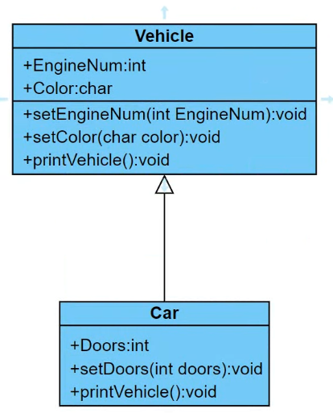
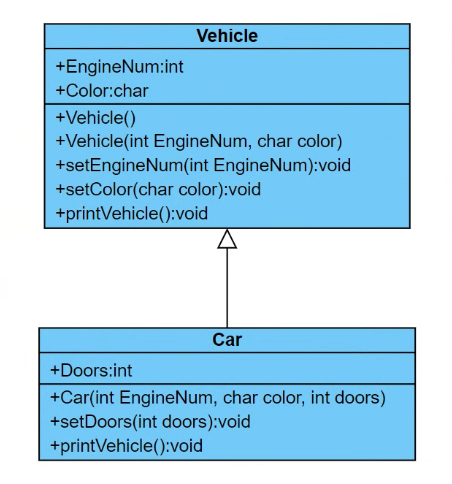
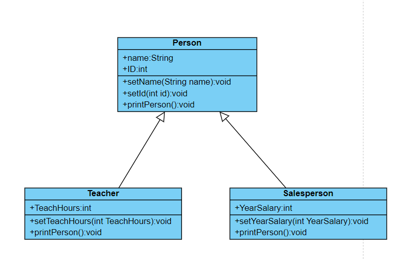

## 練習一

### Description
定義一個 Vehicle 類別，其中車輛的基本資料為引擊號碼（int）和車色（char），並定義適當的 set 方法及輸出方法 printVehicle。

另外，定義 Car 類別繼承 vehicle 類別，並新增資料車門（int），並定義建構方法，呼叫類別的成員方法來設定引擊號碼和車色，並設定車門，

覆寫輸出方法 printCar，其中呼叫父類別的成員方法來輸出引擊號碼和車色，並輸出車門數。



- 車籍資料:
	
	```
	引擊號碼: 1233567
	顏色: W
	車門數: 4
	```
	
	```
	引擊號碼: 5678567
	顏色: B
	車門數: 5
	```

如要更改第二輛車的顏色為 W，請撰寫 method(setCar) 請問如何修改，並再次輸出車籍資料。

```
引擊號碼: 5678567
顏色: W
車門數: 5
```

沒使用 Vehicle 類別、定義 Car 類別繼承 vehicle 類別等方法，提交通過題目者，將會斟酌扣分。

### Input
無

### Output
請使用覆寫輸出方法 printCar，呼叫父類別的成員方法來輸出引擊號碼和車色，並輸出車門數。

接著使用更改 Vehicle 類別裡面的 set 方法，更改第二台車的顏色為 W，再輸出（printCar）。

### Input Samples
```
無
```

### Output Samples
```
Engine Number:1233567
Color:W
Doors Number:4
Engine Number:5678567
Color:B
Doors Number:5
Engine Number:5678567
Color:W
Doors Number:5
```

### Code
```java
public class Main {

	public static void main(String[] args) {

		Car car1 = new Car(1233567, 'W', 4);
		Car car2 = new Car(5678567, 'B', 5);
		car1.printVehicle();
		car2.printVehicle();
		car2.setColor('W');
		car2.printVehicle();
	}
}

class Vehicle {
	private int EngineNum;
	private char Color;

	public Vehicle() {
	}
	
	public void setEngineNum(int EngineNum) {   
		this.EngineNum = EngineNum;
	}

	public int getEngineNum() {   
		return this.EngineNum;
	}

	public void setColor(char Color) {
		this.Color = Color;
	}

	public char getColor() {
		return this.Color;
	}

	public void printVehicle() {
		System.out.printf("Engine Number:%d\n", this.EngineNum);
		System.out.printf("Color:%c\n", this.Color);
	}
}

class Car extends Vehicle {
	private int Doors;

	public Car(int EngineNum, char Color, int Doors) {
		super.setEngineNum(EngineNum);
		super.setColor(Color);
		this.Doors = Doors;
	}

	public void setDoors(int Doors) {
		this.Doors = Doors;
	}

	@Override
	public void printVehicle() {
		System.out.printf("Engine Number:%d\n", super.getEngineNum());
		System.out.printf("Color:%s\n", super.getColor());
		System.out.printf("Doors Number:%d\n", this.Doors);
	}
}
```

## 練習二

### Description
承第一題，請在 Vehicle 定義一個建構方法可以設定引擊號碼、顏色，並在衍生類別 Car 中定義建構方法，使用 super 呼叫父類別的建構方法。



- 車籍資料
	
	```
	引擊號碼: 1233567
	顏色: W
	車門數: 4
	```
	
	```
	引擊號碼: 5678567
	顏色: B
	車門數: 5
	```

沒使用 Vehicle 類別、定義 Car 類別繼承 vehicle 類別等方法，提交通過題目者，將會斟酌扣分。
沒使用 super 呼叫父類別的建構方法等等通過題目者，提交通過題目者，將會斟酌扣分。

### Input
資料與第一題相同

### Output
無

### Input Samples
```
無
```

### Output Samples
```
Engine Number:1233567
Color:W
Doors Number:4
Engine Number:5678567
Color:B
Doors Number:5
```

### Code
```java
public class Main {

	public static void main(String[] args) {

		Car car1 = new Car(1233567, 'W', 4);
		Car car2 = new Car(5678567, 'B', 5);
		car1.printVehicle();
		car2.printVehicle();
	}
}

class Vehicle {
	private int EngineNum;
	private char Color;

	public Vehicle() {
	}

	public Vehicle(int EngineNum, char Color) {
		this.EngineNum = EngineNum;
		this.Color = Color;
	}
	
	public void setEngineNum(int EngineNum) {   
		this.EngineNum = EngineNum;
	}

	public int getEngineNum() {   
		return this.EngineNum;
	}

	public void setColor(char Color) {
        	this.Color = Color;
	}

	public char getColor() {
        	return this.Color;
	}

	public void printVehicle() {
       		System.out.printf("Engine Number:%d\n", this.EngineNum);
        	System.out.printf("Color:%c\n", this.Color);
	}
}

class Car extends Vehicle {
	private int Doors;

	public Car(int EngineNum, char Color, int Doors) {
		super(EngineNum, Color);
		this.Doors = Doors;
	}

	public void setDoors(int Doors) {
		this.Doors = Doors;
	}

	@Override
	public void printVehicle() {
		System.out.printf("Engine Number:%d\n", super.getEngineNum());
		System.out.printf("Color:%s\n", super.getColor());
		System.out.printf("Doors Number:%d\n", this.Doors);
	}
}
```

## 練習三

### Description
請宣告 Person 類別，擁有 name 姓名和 id 編號，新增 printPerson 成員方法可以顯示個人資料。

另外，請新增 Teacher 老師子類別和 Salesperson 業務員子類別來繼承 Person，

在老師子類類別中新增授課時數(共18週)，

業務員子類別新增年薪成員變數，

覆寫 printPerson 成員方法顯示老師平均每週授課時間和業務員的月薪。


老師平均每週授課時間 = 授課時數 / 18

業務員的月薪 =  年薪 / 12

- 成員資料

	```
	姓名: Eric
	ID: 159598
	類別: Teacher
	授課時數: 144
	```

	```
	姓名: Amy
	ID: 158965
	類別: Salesperson
	年薪: 432000
	```



### Input
無

### Output
無

### Input Samples
```
無
```

### Output Samples
```
Name:Eric
ID:159598
Type:Teacher
AverageHours:8
Name:Amy
ID:158965
Type:Salesperson
Salary:36000
```

### Code
```java
public class Main {

	public static void main(String[] args) {

		Teacher teacher = new Teacher("Eric", 159598, 144);
		Salesperson salesperson = new Salesperson("Amy", 158965, 432000);
		teacher.printPerson();
		salesperson.printPerson();
	}
}

class Person {
	private int ID;
	private String Name;

	public Person(String Name, int ID) {
		this.Name = Name;
		this.ID = ID;
	}
	
	public void setId(int ID) {   
		this.ID = ID;
	}

	public void setName(String Name) {
        	this.Name = Name;
	}

	public void printPerson() {
		System.out.printf("Name:%s\n", this.Name);
		System.out.printf("ID:%d\n", this.ID);
	}
}

class Teacher extends Person {
	private int TeachHours;

	public Teacher(String Name, int ID, int TeachHours) {
		super(Name, ID);
		this.TeachHours = TeachHours;
	}

	public void setTeachHours(int TeachHours) {
		this.TeachHours = TeachHours;
	}

	@Override
	public void printPerson() {
		super.printPerson();
		System.out.println("Type:Teacher");
		System.out.printf("AverageHours:%d\n", this.TeachHours / 18);
	}
}

class Salesperson extends Person {
	private int YearSalary;

	public Salesperson(String Name, int ID, int YearSalary) {
		super(Name, ID);
		this.YearSalary = YearSalary;
	}

	public void setYearSalary(int YearSalary) {
		this.YearSalary = YearSalary;
	}

	@Override
	public void printPerson() {
		super.printPerson();
		System.out.println("Type:Salesperson");
		System.out.printf("Salary:%d\n", this.YearSalary / 12);
	}
}
```
