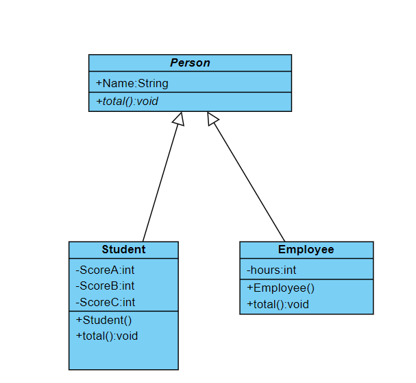
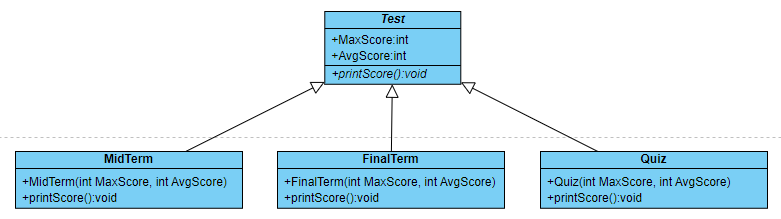
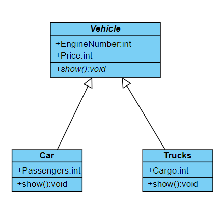

## 練習一

### Description
請建立 `Person` **抽象類別**宣告和 `total()` **抽象方法**

其繼承的 `Student` 子類別擁有不同 3 次考試成績，`total` 方法可以計算總分

其繼承的 `Employee` 子類別擁有 hours 的每月工作時數，`total` 方法可以計算每日工時（一月 24 天）和工資（每小時 800 元）

- UML 圖

    

> 注意 `Person` 是斜體，代表抽象類別（abstract class），它的方法 `total()` 也是斜體，代表抽象方法（abstract method）。
> 依照上圖，`Person` 實做出來的程式碼參考如下： 
    ```java
    abstract class Person {
        String name = "";
        abstract void total();
    }
    ```

- Student 資料：
    
    ```
    Name: Eric
    成績A: 97
    成績B: 80
    成績C: 87
    ```

- Employee 資料：
    
    ```
    hours: Amy
    hours: 168
    ```

- Student 的 `total` 方法請輸出姓名與總分。
    
    ```
    EX:
    Name: Eric
    Total score: 264
    ```

- Employee 的 `total` 方法請輸出每日工時與月薪。
    
    ```
    EX:
    Name: Amy
    Daily hours: 7
    Salary: 134400
    ```

### Input
無

### Output
請輸出 Student 與 Employee 的資料（使用 `total()` 方法）。

### Input Samples
```
無
```

### Output Samples
```
Name: Eric
Total score: 264
Name: Amy
Daily hours: 7
Salary: 134400
```

### Code
```java
public class Main {

    public static void main(String[] args) {

        Student stu = new Student("Eric", 97, 80, 87);
        Employee emp = new Employee("Amy", 168);
        stu.total();
        emp.total();
    }
}

abstract class Person {
    String name = "";

    abstract void total();
}

class Student extends Person {
    private int ScoreA;
    private int ScoreB;
    private int ScoreC;

    public Student(String name, int ScoreA, int ScoreB, int ScoreC) {
        this.name = name;
        this.ScoreA = ScoreA;
        this.ScoreB = ScoreB;
        this.ScoreC = ScoreC;
    }

    public void total() {
        System.out.printf("Name: %s\n", this.name);
        System.out.printf("Total score: %d\n", this.ScoreA + this.ScoreB + this.ScoreC);
    }
}

class Employee extends Person {
    private int hours;

    public Employee(String name, int hours) {
        this.name = name;
        this.hours = hours;
    }

    public void total() {
        System.out.printf("Name: %s\n", this.name);
        System.out.printf("Daily hours: %d\n", this.hours / 24);
        System.out.printf("Salary: %d\n", this.hours * 800);
    }
}
```

## 練習二

### Description
請建立 `Test` 抽象類別，然後建立 `MidTerm`、`Final` 及 `Quiz` 子類別，

多型的 `printScore` 方法可以顯示各次考試的最高和平均成績。



`MidTerm` 的 `printScore` 方法請輸出 `MidTerm` 的最高成績和平均成績。
`FinalTerm` 的 `printScore` 方法請輸出 `FinalTerm` 的最高成績和平均成績。
`Quiz` 的 `printScore` 方法請輸出 `Quiz  的最高成績和平均成績。

- 成績資料：

  - MidTerm
      
      ```
      最高成績: 98
      平均成績: 60
      ```

  - FinalTerm
      
      ```
      最高成績: 87
      平均成績: 63
      ```
  - Quiz

      ```
      最高成績: 100
      平均成績: 77
    ```

### Input
無

### Output
請輸出 MidTerm、Final 及 Quiz 的最高成績以及平均成績。

### Input Samples
```
無
```

### Output Samples
```
MidTerm:
MaxScore:98
AvgScore:60
FinalTerm:
MaxScore:87
AvgScore:63
Quiz:
MaxScore:100
AvgScore:77
```

### Code
```java
public class Main {

    public static void main(String[] args) {

        MidTerm mid = new MidTerm(98, 60);
        FinalTerm fin = new FinalTerm(87, 63);
        Quiz quiz = new Quiz(100, 77);
        mid.printSore();
        fin.printSore();
        quiz.printSore();
    }
}

abstract class Test {
    int MaxScore, AvgScore;

    abstract void printSore();
}

class MidTerm extends Test {

    public MidTerm(int MaxScore, int AvgScore) {
        this.MaxScore = MaxScore;
        this.AvgScore = AvgScore;
    }

    public void printSore() {
        System.out.println("MidTerm:");
        System.out.printf("MaxScore:%d\n", this.MaxScore);
        System.out.printf("AvgScore:%d\n", this.AvgScore);
    }
}

class FinalTerm extends Test {

    public FinalTerm(int MaxScore, int AvgScore) {
        this.MaxScore = MaxScore;
        this.AvgScore = AvgScore;
    }

    public void printSore() {
        System.out.println("FinalTerm:");
        System.out.printf("MaxScore:%d\n", this.MaxScore);
        System.out.printf("AvgScore:%d\n", this.AvgScore);
    }
}

class Quiz extends Test {

    public Quiz(int MaxScore, int AvgScore) {
        this.MaxScore = MaxScore;
        this.AvgScore = AvgScore;
    }

    public void printSore() {
        System.out.println("Quiz:");
        System.out.printf("MaxScore:%d\n", this.MaxScore);
        System.out.printf("AvgScore:%d\n", this.AvgScore);
    }
}
```

## 練習三

### Description
請建立 `Vehicle` 抽象類別，然後建立 `Car` 和 `Trucks` 子類別，多型的 `Show()` 方法可以顯示車輛資料。




`Car` 的 `show` 方法請輸出引擊號碼、價格和乘客人數。
    
    ```
    EX:
    Engine Number: 1233567
    Price:800000
    Passengers:7
    ```

`Trucks` 的 `show` 方法請輸出引擊號碼、價格和載貨量。

    ```
    EX:
    Engine Number: 5678567
    Price: 1200000
    Cargo Capacity: 30
    ```

- Car 資料：

    ```
    引擊號碼: 1233567
    價格: 800000
    乘客人數: 7
    ```

- Trucks 資料：

    ```
    引擊號碼: 5678567
    價格: 1200000
    載貨量: 30
    ```

- 多型的應用方法（參考）
    
    ```java
    public static void main(String[] args) {
        Main2 ma = new Main2();

        Car c1 = new Car();
        c1.EngineNumber = 1233567;
        c1.Price = 800000;
        c1.Passengers = 7;

        Trucks t1 = new Trucks();
        t1.EngineNumber = 5678567;
        t1.Price = 1200000;
        t1.Passengers = 30;

        ma.showVehicle(c1);
        ma.showVehicle(t1);
    }

    public void showVehicle(Vehicle v) {
        v.show();
    }
    ```


### Input
無

### Output
請使用 `show()` 輸出上述車量的資料。

### Input Samples
```
無
```

### Output Samples
```
Engine Number:1233567
Price:800000
Passengers:7
Engine Number:5678567
Price:1200000
Cargo Capacity:30
```

### Code
```java
public class Main {

    public static void main(String[] args) {

        Car car = new Car(1233567, 800000, 7);
        Trucks trucks = new Trucks(5678567, 1200000, 30);
        car.show();
        trucks.show();
    }
}

abstract class Vehicle {
    int EngineNumber, Price;

    abstract void show();
}

class Car extends Vehicle {
    private int Passengers;

    public Car(int EngineNumber, int Price, int Passengers) {
        this.EngineNumber = EngineNumber;
        this.Price = Price;
        this.Passengers = Passengers;
    }

    public void show() {
        System.out.printf("Engine Number:%d\n", this.EngineNumber);
        System.out.printf("Price:%d\n", this.Price);
        System.out.printf("Passengers:%d\n", this.Passengers);
    }
}

class Trucks extends Vehicle {
    private int Cargo;

    public Trucks(int EngineNumber, int Price, int Cargo) {
        this.EngineNumber = EngineNumber;
        this.Price = Price;
        this.Cargo = Cargo;
    }

    public void show() {
        System.out.printf("Engine Number:%d\n", this.EngineNumber);
        System.out.printf("Price:%d\n", this.Price);
        System.out.printf("Cargo Capacity:%d\n", this.Cargo);
    }
}
```
