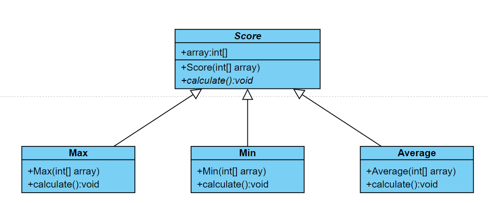

## 第一題

### Description
- （80%）請建立以下 UML 圖的 class 類別。

  1. 建立 Score 抽象類別，裡面有一個 int 陣列 array。
      建構方法 `Score(int[] array)` 中，請設定資料 array。
      在此抽象類別中建立抽象方法 `calculate():void`（抽象方法不需實作出來）。

  2. 建立 Max 類別，建構方法 Max(int[] array) 中，請設定資料 array。
      請實作方法 `calculate()`，找出並顯示 array 中的最大數值。

  3. 建立 Min 類別，建構方法 Min(int[] array) 中，請設定資料 array。
      請實作方法 `calculate()`，找出並顯示 array 中的最小數值。

  4. 建立 Average 類別，建構方法 Average(int[] array) 中，請設定資料 array。
      請實作方法 `calculate()`，找出並顯示 array 中的平均數值。

  

- （20%）請在 main() 中加入以下內容。

  1. 宣告 `int[] array`。
  2. 建立 Max Min Average 的物件建構子中的參數是 array。
  3. 呼叫方法 `cal()`，讓此方法去呼叫 Score 類別裡面的 `calculate()`，實現多型的概念。

    
      ```java
      public static void main(String[] args) {
          int[] array = {60, 86, 34, 100, 57, 23};

          score max = new Max(array);
          Score min = new Min(array);
          Score average = new Average(array);

          cal(max);
          cal(min);
          cal(average);
      }

      public static void cal(Score s) {
          s.calculate();
      }
      ```

### Input
本題無輸入，請自行在程式碼中加入 array 的數值。

array 中的數值：{60, 86, 34, 100, 57, 23}

### Output
請輸出 Max Min Average 的 calculate() 結果。

### Input Samples
```
無
```

### Output Samples
```
100
23
60
```

### Code
```java
public class Main {

    public static void main(String[] args) {
        int[] array = { 60, 86, 34, 100, 57, 23 };

        Score max = new Max(array);
        Score min = new Min(array);
        Score average = new Average(array);

        cal(max);
        cal(min);
        cal(average);
    }

    public static void cal(Score s) {
        s.calculate();
    }
}

public abstract class Score {
    public int[] array;

    public Score() {
    }

    public Score(int[] array) {
        this.array = array;
    }

    abstract public void calculate();
}

class Max extends Score {
    public Max(int[] array) {
        super(array);
    }

    public void calculate() {
        int max = 0;
        for (int i = 0; i < array.length; i++) {
            if (array[i] > max) {
                max = array[i];
            }
        }
        System.out.println(max);
    }
}

class Min extends Score {
    public Min(int[] array) {
        super(array);
    }

    public void calculate() {
        int min = 9999;
        for (int i = 0; i < array.length; i++) {
            if (array[i] < min) {
                min = array[i];
            }
        }
        System.out.println(min);
    }
}

class Average extends Score {
    public Average(int[] array) {
        super(array);
    }

    public void calculate() {
        int total = 0;
        for (int i = 0; i < array.length; i++) {
            total += array[i];
        }
        System.out.println(total / array.length);
    }
}
```

## 第二題

### Description
- （80%）請建立以下 UML 圖的 class 類別。

    1. 首先建立 person 
        - 類別裡面有三個私有（private）變數：name 是 String、age 是 int、 id 是 String。
        - 建立一個空白建構方法 `person()` 裡面不做任何事。
        - 建立一個建構方法 `person(String name, int age, String id)` 裡面要設定人物資料。
        - 建立一個不用回傳的方法 `printPerson()`，顯示人物資料，格式請見輸出說明與範例。
    
    2. 建立 teacher 類別
        - 繼承 person，裡面有一個私有變數 salary，型態是 int。
        - 建立一個建構方法 `teacher(String name, int age, String id, int salary)` 裡面要設定老師資料。
        - 覆寫 person 的方法 `printPerson()`，顯示老師的資料，格式請見輸出說明與範例。

    3. 建立 student 類別
        - 繼承 person，裡面有一個私有變數 grade，型態是 int。
        - 建立一個建構方法 `student(String name, int age, String id, int grade)` 裡面要設定學生資料。

    4. 建立 master（碩士）類別
        - 繼承 student，裡面有一個私有變數 adviser（指導教授），型態是 String。
        - 建立一個建構方法 `master(String name, int age, String id, int grade, String adviser)` 裡面要設定碩士生資料。
        - 覆寫 person 的方法 `printPerson()`，顯示碩士生的資料，格式請見輸出說明與範例。

    5. 建立 bachelor(大學生)類別
        - 繼承 student，裡面有一個私有變數 project（畢業專題），型態是 String。
        - 建立一個建構方法 `bachelor(String name, int age, String id, int grade, String project)` 裡面要設定大學生資料。
        - 覆寫 person 的方法 `printPerson()`，顯示大學生的資料，格式請見輸出說明與範例。

- （20%）最後，請在 main() 裡面實作出 master、bachelor、teacher 的物件，並利用建構方法設定資料，最後呼叫 `printPersin()` 輸出人物資料。
  - 如下程式碼參考

      ```java
      public static void main(String[] args) {
          master Amy = new master("Amy", 23, "M0856195", 1, "Ian");
          Amy.printPerson();

          bachelor Eric = new bachelor("Eric", 20, "D0812659", 3, "SIEM");
          Eric.printPerson();

          teacher Leo = new teacher("Leo", 32, "T871689", 1470000);
          Leo.printPerson();
      }
      ```

### Input
本題無輸入，請自己產生以下資料。

- master:
    
    ```
    Name: Amy
    Age: 23
    ID: M0856195
    Adviser: Ian
    ```

- bachelor:
    
    ```
    Name: Eric
    Age: 20
    ID: D0812659
    Bachelor
    Project: SIEM
    ```

- teacher:
    
    ```
    Name: Leo
    Age: 32
    ID: T871689
    Salary: 1470000
    ```

### Output
請輸出 master、bachelor、teacher 的資料。

格式如下：

- master:
    
    ```
    Name: Amy
    Age: 23
    ID: M0856195
    Master
    Adviser: Ian
    ```

- bachelor:
    
    ```
    Name: Eric
    Age: 20
    ID: D0812659
    Bachelor
    Project: SIEM
    ```

- teacher:
    
    ```
    Name: Leo
    Age: 32
    ID: T871689
    Teacher
    Salary: 1470000
    ```

### Input Samples
```
無
```

### Output Samples
```
Name: Amy
Age: 23
ID: M0856195
Master
Adviser: Ian
Name: Eric
Age: 20
ID: D0812659
Bachelor
Project: SIEM
Name: Leo
Age: 32
ID: T871689
Teacher
Salary: 1470000
```

### Code
```java
public class Main {

    public static void main(String[] args) {

        master Amy = new master("Amy", 23, "M0856195", 1, "Ian");
        Amy.printPerson();

        bachelor Eric = new bachelor("Eric", 20, "D0812659", 3, "SIEM");
        Eric.printPerson();

        teacher Leo = new teacher("Leo", 32, "T871689", 1470000);
        Leo.printPerson();
    }
}

class person {
    private String name;
    private int age;
    private String id;

    public person() {
    }

    public person(String name, int age, String id) {
        this.name = name;
        this.age = age;
        this.id = id;
    }

    public void printPerson() {
        System.out.println("Name: " + this.name);
        System.out.println("Age: " + this.age);
        System.out.println("ID: " + this.id);
    }
}

class teacher extends person {
    private int salary;

    public teacher(String name, int age, String id, int salary) {
        super(name, age, id);
        this.salary = salary;
    }

    @Override
    public void printPerson() {
        super.printPerson();
        System.out.println("Teacher");
        System.out.println("Salary: " + this.salary);
    }
}

class student extends person {
    private int grade;

    public student(String name, int age, String id, int grade) {
        super(name, age, id);
        this.grade = grade;
    }
}

class master extends student {
    private String adviser;

    public master(String name, int age, String id, int grade, String adviser) {
        super(name, age, id, grade);
        this.adviser = adviser;
    }

    @Override
    public void printPerson() {
        super.printPerson();
        System.out.println("Master");
        System.out.println("Adviser: " + this.adviser);
    }
}

class bachelor extends student {
    private String project;

    public bachelor(String name, int age, String id, int grade, String project) {
        super(name, age, id, grade);
        this.project = project;
    }

    @Override
    public void printPerson() {
        super.printPerson();
        System.out.println("Bachelor");
        System.out.println("Project: " + this.project);
    }
}
```

## 第三題

### Description
- （25%）定義 PasswordLengthException 例外類別，類別中應該有一個無參數的建構子。
  - 覆寫 `getMessage()`，回傳 "Invalid length"。
  - 如果使用者所輸入的密碼長度不在 6 ~ 20 的範圍內（範圍：6 <= pw <= 20），則抛出例外。

- （25%）定義 PasswordSymbolException 例外類別，類別中應該有一個無參數的建構子。
  - 覆寫 `getMessage()` ，回傳 "Invalid symbol"。
  - 如果使用者所輸入的密碼長度包含 `{ } & | '` 這 5 個符號，則抛出例外。

- （50%）在 main() 方法中建立 try catch 來丟出例外與處理例外。 

### Input
無

### Output
無

### Input Samples 1
```
123
```

### Output Samples 1
```
Invalid length
```

### Input Samples 2
```
12345|
```

### Output Samples 2
```
Invalid symbol
```

### Input Samples 3
```
{abcdef
```

### Output Samples 3
```
Invalid symbol
```

### Code
```java
import java.util.Scanner;

public class Main {

    public static void main(String[] args) {

        try {
            Scanner s = new Scanner(System.in);
            String passwd = s.next();

            if (passwd.length() < 6 || passwd.length() > 20) {
                throw new PasswordLengthException();
            }

            if (passwd.contains("&") || passwd.contains("|") || passwd.contains("{") || passwd.contains("}") || passwd.contains("'")) {
                throw new PasswordSymbolException();
            }

        } catch (PasswordLengthException p) {
            System.out.println(p.getMessage());
        } catch (PasswordSymbolException p) {
            System.out.println(p.getMessage());
        }
    }

}

class PasswordLengthException extends Exception {
    @Override
    public String getMessage() {
        return "Invalid length";
    }
}

class PasswordSymbolException extends Exception {
    @Override
    public String getMessage() {
        return "Invalid symbol";
    }
}
```
